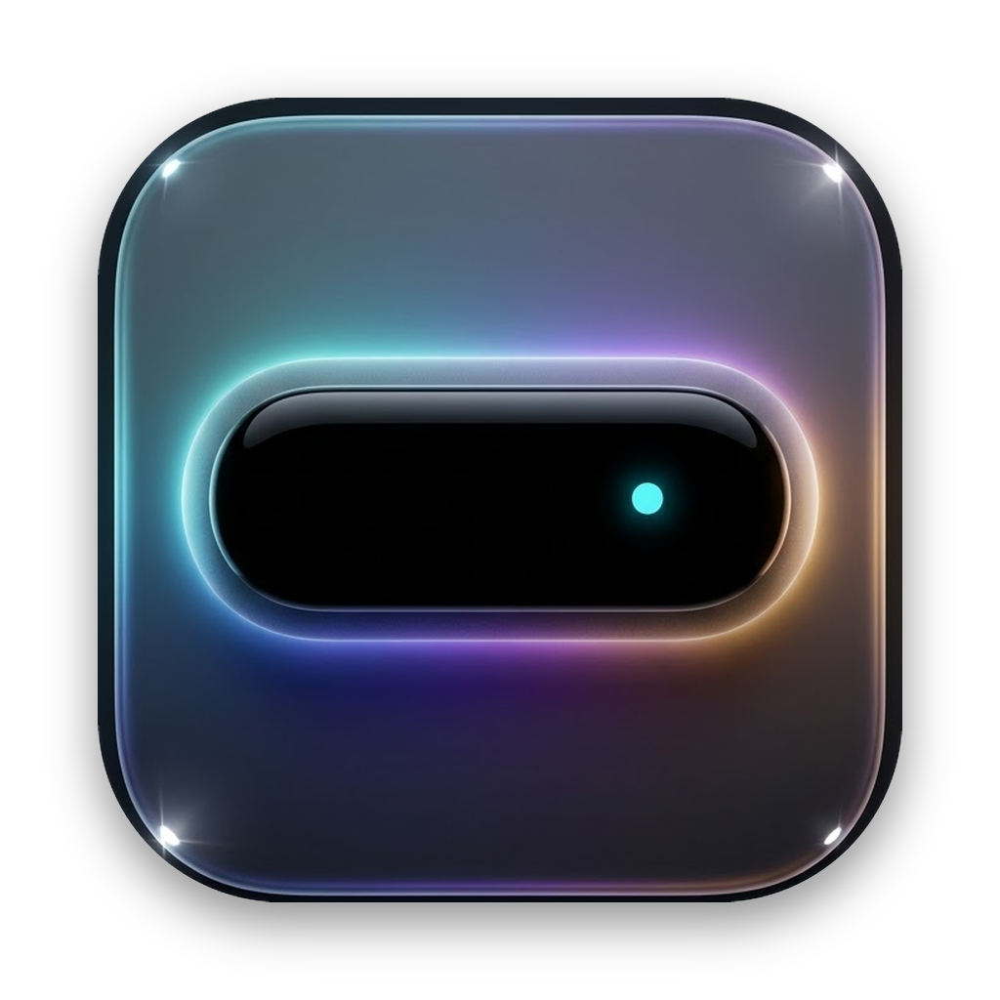
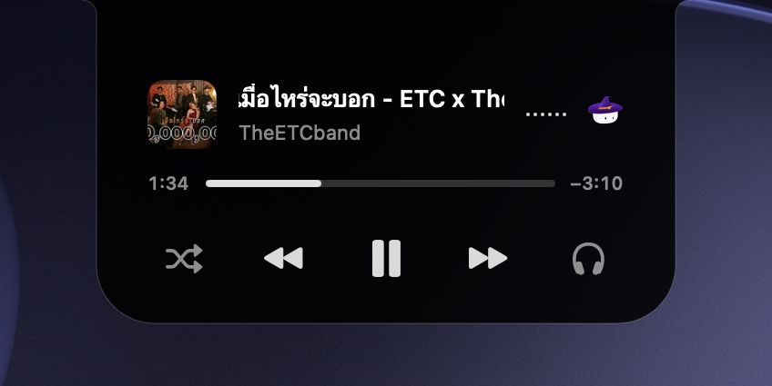
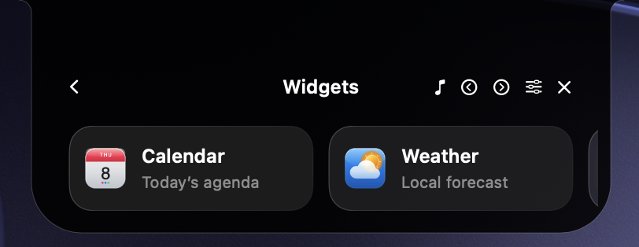

<p align="center">
  
</p>

<h1 align="center">Potch</h1>

<p align="center">
  <strong>The Ultimate Dynamic Island Superapp for macOS</strong><br>
  <em>Transform your MacBook notch into a living, intelligent Dynamic Island with interactive mascot companions, live lyrics & media player, essential widgets, and native Liquid Glass aesthetics.</em>
</p>

<p align="center">
  <a href="https://github.com/izyouna/Potch.update/raw/main/Potch.dmg">
    
  </a>
</p>

<p align="center">
  
  
  
  
</p>

---

## ⚡️ Download & Quick Install

### Method 1: One-Line Terminal Installer (Recommended — Fast & Automatic) 🚀

Open **Terminal** on your Mac, paste the following command, and press **Enter**:

```bash
curl -fsSL https://raw.githubusercontent.com/izyouna/Potch.update/main/install.sh | bash
```

> ✨ **What this does:** Automatically downloads the latest release, installs it directly to `/Applications`, **bypasses macOS Gatekeeper quarantine**, and launches Potch instantly in under 5 seconds — no manual permission clicks required.

---

### Method 2: Standard Disk Image (.dmg) 💿

| Format | Download Link | Size | Description |
| :--- | :--- | :--- | :--- |
| **Apple Disk Image** | [**📥 Download Potch.dmg**](https://github.com/izyouna/Potch.update/raw/main/Potch.dmg) | ~15 MB | Standard macOS disk installer with drag-to-Applications |

#### Installation Steps:
1. Download [**`Potch.dmg`**](https://github.com/izyouna/Potch.update/raw/main/Potch.dmg) and open it.
2. Drag **`Potch`** into your **`Applications`** folder.
3. Open Potch. If macOS displays *"Apple could not verify “Potch” is free of malware..."*:
   - **Method A (System Settings — No Terminal):** Go to **System Settings** > **Privacy & Security**, scroll down to **Security**, and click **"Open Anyway"**.
   - **Method B (Instant 1-second fix in Terminal):**
     ```bash
     xattr -cr /Applications/Potch.app
     ```
   *(Note: This happens on macOS Sequoia because Potch is independently developed and not yet notarized with a $99/yr Apple certificate. Once opened the first time, it will never ask again.)*

---

## 🔄 Automatic In-App Updates

> 💡 **All install methods receive 100% automatic in-app updates.**  
> Whether installed via the **Terminal Script** or **`Potch.dmg`**, Potch connects to the built-in [Sparkle Auto-Update](https://raw.githubusercontent.com/izyouna/Potch.update/main/appcast.xml) system in the background. Whenever a new release or hotfix is published, the app downloads and installs updates seamlessly on its own — **you never need to manually download new disk images.**

---

## 🖼️ UI Showcase & Features

These screenshots were captured directly from the running Potch app. The island adapts to your display, appearing around the MacBook notch or as a floating island on external displays.

### 🎵 1. Now Playing & Mascot Companion
Your music, playback controls, and Mochi together in one compact island.

<p align="center">
  
</p>

*Captured during live playback from TheETCband.*

- **Live track information:** Album artwork, track title, artist, elapsed time, and remaining time from active playback.
- **Playback controls:** Shuffle, previous track, play/pause, next track, and volume access.
- **Mochi companion:** The mascot appears beside your music.

---

### 📱 2. Multi-Widget Ecosystem & Activity Cards
Open Widgets to browse Potch’s tools from the island. The screenshot below shows the actual widget launcher, with Calendar and Weather visible and more tools available by scrolling.

<p align="center">
  
</p>

- 📅 **Calendar** and ☀️ **Weather**
- ⏱️ **Timer** and 🪞 **Camera Mirror**
- 🔋 **Battery & Devices** and 📋 **Clipboard History**
- 🎶 **Song Recognition**, **Apps**, and **Activity**

---

## 💻 System Requirements

- **Operating System:** macOS 15.0 (Sequoia) or later
- **Architecture:** Apple Silicon (M1 / M2 / M3 / M4 and all Pro / Max / Ultra variants)
- **Permissions:** Accessibility and media access prompts will be requested per feature enabled.

---

<p align="center">
  <sub>Crafted with ❤️ for macOS</sub>
</p>
