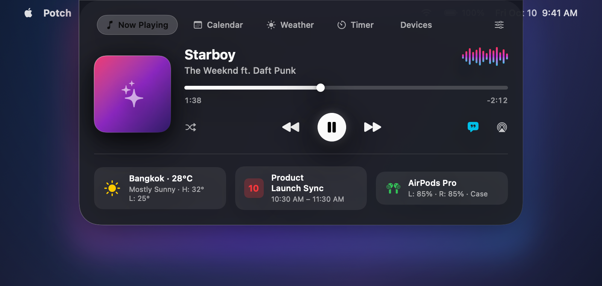
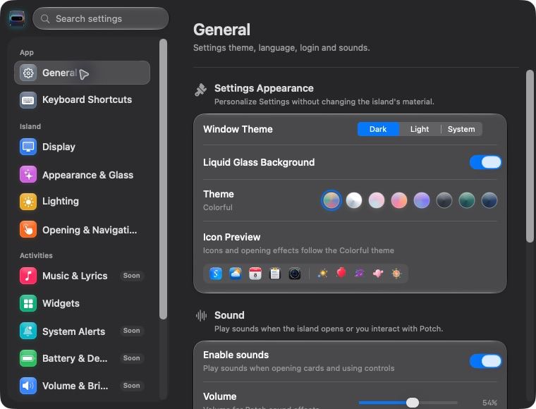

<p align="center">
  
</p>

<h1 align="center">Potch</h1>

<p align="center">
  <strong>The Ultimate Dynamic Island Superapp for macOS</strong><br>
  <em>Transform your MacBook notch into a living, intelligent Dynamic Island with interactive mascot companions, live lyrics & media player, essential widgets, and native Liquid Glass aesthetics.</em>
</p>

<p align="center">
  <a href="https://github.com/izyouna/Potch.update/raw/main/Potch.dmg">
    
  </a>
</p>

<p align="center">
  
  
  
  
</p>

---

## ⚡️ Download & Quick Install

### Method 1: One-Line Terminal Installer (Recommended — Fast & Automatic) 🚀

Open **Terminal** on your Mac, paste the following command, and press **Enter**:

```bash
curl -fsSL https://raw.githubusercontent.com/izyouna/Potch.update/main/install.sh | bash
```

> ✨ **What this does:** Automatically downloads the latest release, installs it directly to `/Applications`, **bypasses macOS Gatekeeper quarantine**, and launches Potch instantly in under 5 seconds — no manual permission clicks required.

---

### Method 2: Standard Disk Image (.dmg) 💿

| Format | Download Link | Size | Description |
| :--- | :--- | :--- | :--- |
| **Apple Disk Image** | [**📥 Download Potch.dmg**](https://github.com/izyouna/Potch.update/raw/main/Potch.dmg) | ~15 MB | Standard macOS disk installer with drag-to-Applications |

#### Installation Steps:
1. Download [**`Potch.dmg`**](https://github.com/izyouna/Potch.update/raw/main/Potch.dmg) and double-click to open.
2. Drag the **`Potch`** icon into the **`Applications`** folder.
3. **Double-click `Open Potch (First Time).command`** located inside the disk image. The script will automatically authorize the app with Gatekeeper and launch it immediately.

---

## 🔄 Automatic In-App Updates

> 💡 **All install methods receive 100% automatic in-app updates.**  
> Whether installed via the **Terminal Script** or **`Potch.dmg`**, Potch connects to the built-in [Sparkle Auto-Update](https://raw.githubusercontent.com/izyouna/Potch.update/main/appcast.xml) system in the background. Whenever a new release or hotfix is published, the app downloads and installs updates seamlessly on its own — **you never need to manually download new disk images.**

---

## 🖼️ UI Showcase & Features

### 🏝️ 1. Dynamic Notch & Mascot Companion ("Mochi")
A sleek, obsidian island seamlessly hugging the physical MacBook display notch with fluid spring animations and an interactive mascot companion that looks and responds to your cursor in real time.

<p align="center">
  
</p>

- **1px Overflow Edge Trick:** Perfectly conceals the physical boundary between display bezel and screen pixels.
- **Concave Shoulders:** Elegant 12pt curved contours naturally blend the notch into the macOS menu bar.
- **4 Dynamic Glow Modes:** Radiates real-time ambient lighting around the notch — Album Aura, Ambient White, Aurora Breathing, or Custom Hex Accent.
- **Interactive Companion Mochi:** Adorable desk mascot with responsive eye-gaze tracking and custom outfits.

---

### 📱 2. Multi-Widget Ecosystem & Activity Cards
Expand the island downwards with a single click or hover to reveal a suite of multi-purpose activity tools and playback controls in one unified liquid glass interface.

<p align="center">
  
</p>

- 🎵 **Now Playing & Lyrics:** High-fidelity album artwork, live 20-band FFT audio visualizer, scrub bar, and AirPlay output switcher for Apple Music and Spotify.
- 📅 **Calendar & Schedule:** Full monthly overview with upcoming event timeline and instant calendar sync.
- ☀️ **Weather Forecast:** Atmospheric animations, hourly forecasts, and 5-day temperature range radar.
- ⏱️ **Focus Timer:** Minimalist Pomodoro and countdown timer with audible bell alerts.
- 🪞 **Camera Mirror:** Front camera mirror with high-pass skin smoothing and screen rim light for low-light calls.
- 🔋 **Battery & Devices:** Real-time battery status for your Mac, left/right AirPods, charging case, and wireless peripherals.
- 📋 **Clipboard History:** Quick access to your last 20 copied clips with drag-and-drop instant paste.

---

### 🪟 3. Native Liquid Glass Settings
Comprehensive settings panel spanning 12 distinct categories, engineered strictly with native macOS SwiftUI components and translucent Liquid Glass materials.

<p align="center">
  
</p>

- **8 Glass Color Themes:** Colorful, Silver, Blush, Sunset, Indigo, Graphite, Emerald, and Midnight.
- **Mascot Wardrobe:** Accessorize Mochi with custom hats, glasses, headphones, and seasonal outfits.
- **Precision Lighting & Audio Controls:** Tailor glow speed, brightness, blur clarity, and 9 distinct UI sound events.

---

## 💻 System Requirements

- **Operating System:** macOS 15.0 (Sequoia) or later
- **Architecture:** Apple Silicon (M1 / M2 / M3 / M4 and all Pro / Max / Ultra variants)
- **Permissions:** Accessibility and media access prompts will be requested per feature enabled.

---

<p align="center">
  <sub>Crafted with ❤️ for macOS</sub>
</p>
